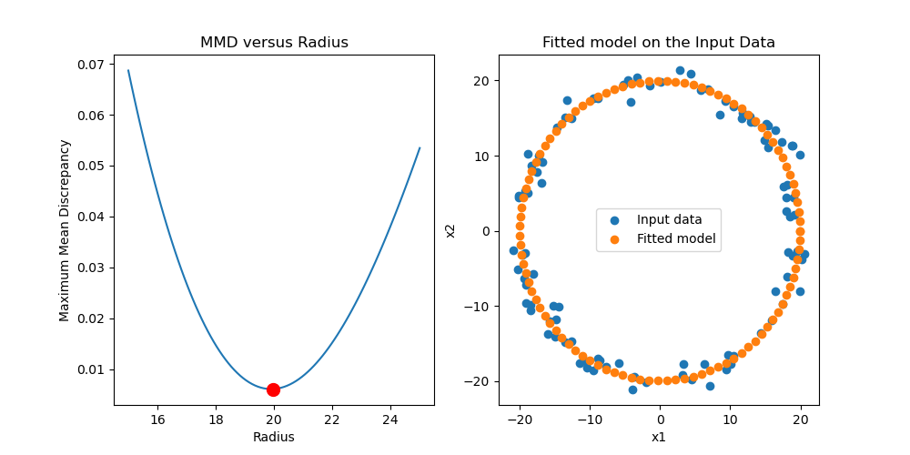

# A short demo on the MMD

This is a short excerpt of my Master's thesis: data-driven prediction of pharmaceutical granules'size (Note: original code is written in Julia). Please don't be afraid of some of the mathematical notation. As you will see the toy problem is very simple and the MMD is an intuitive measure of distance between distributions.

### The toy problem
Consider the following toy problem, illustrated in Figure 3.9. Given noisy data points that lay in a circular shape, is it possible to find a model fit of 100 equally spaced points that lay on a circle with a radius that represents the input data?

### The MMD
This problem can be solved using kernel mean embedding, particularly us- ing the maximum mean discrepancy. The MMD corresponds to the RKHS distance between mean embeddings (Gretton et al., 2012; Borgwardt et al., 2006):

The empirical MMD:

This distance between mean embeddings of features represents the distance between distributions in the input space. In other words, the smaller the MMD, the smaller the distance is between distributions in the input space. This can be used to find a model to fit the training data of the toy problem.
### The solution - for details see the code
First, a Gaussian kernel is defined. Second, 100 circles are generated with 100 equally spaced points. Each circle has a different radius ranging from 15 to 25. To compute the MMD between these circles and the input data, several Gram matrices need to be computed (on the input data, a generated model, and on both the input and generated model). With the computed Gram matrices, for each generated circle, the MMD can be calculated.

The obtained MMDs can be plotted versus the radius of each corresponding generated circle. The value for the radius of the best model fitted on the input data can be obtained. The fitted distribution is plotted. The distance between the embedding of this model and the embedding of the input data is the lowest out of all generated circles, meaning the model fits the input data the best in the input space.

